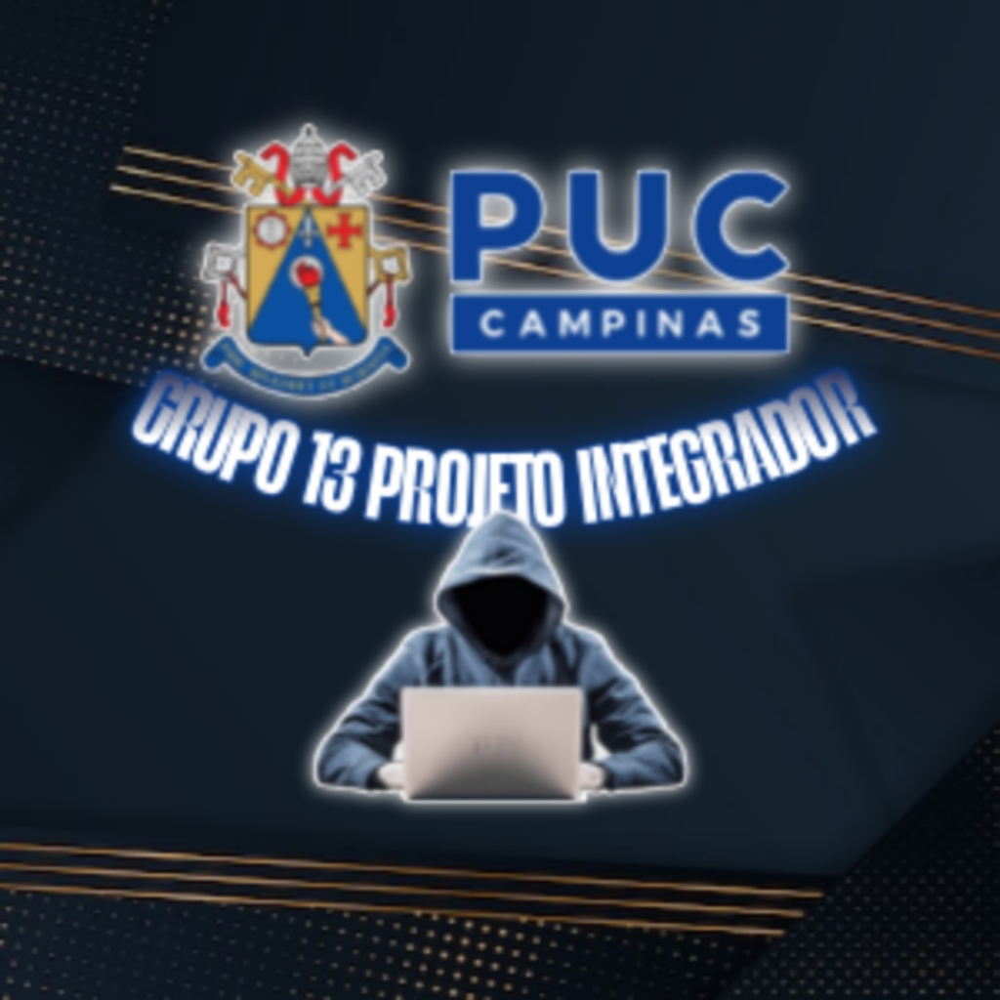

  

# ES-PI2-2025-T03-G13
Trabalho criado pela turma 13 da PUCC pela matéria "Projeto Integrador", do 1 semestre, visando acesso do professor ao sistema para lançamento de notas e consequentemente média dos alunos. Projeto NotaDez
